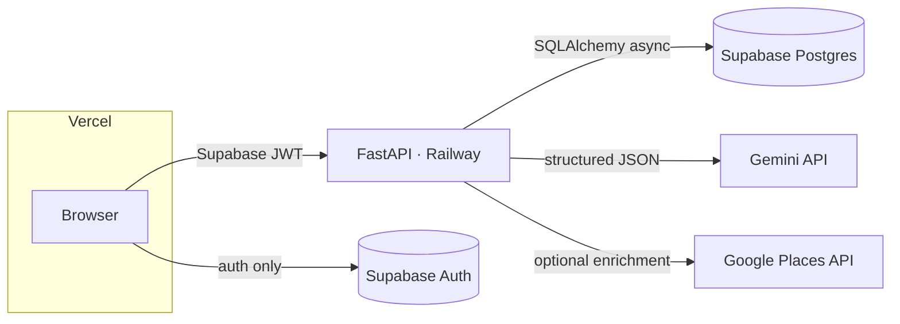

# AI Travel Itinerary Planner

Enter a destination, dates, budget, travellers, interests, travel style, and pace →
get a day-by-day itinerary with recommended attractions, food and activity suggestions,
timings, and an estimated daily budget. Trips are saved per user and every stop is editable.

## Features

- **Generate** a full itinerary from 7 inputs (Gemini structured JSON; deterministic mock
  when no API key is set, so the whole flow works offline)
- **Edit everything** — inline-edit any stop (title, category, times, cost, notes), edit a
  day's summary and budget, add/delete stops, reorder within a day
- **Regenerate** replaces AI-written days but keeps anything you hand-edited (`is_user_edited`)
- **Cost breakdown** — total, per person, per day, and by category
- **Saved trips**, editable trip parameters, print-friendly view
- **Auth** via Supabase (email magic link + Google); the API verifies both asymmetric
  (JWKS) and legacy (HS256) Supabase JWTs
- Light/dark theme, loading skeletons, optimistic updates, responsive layout

## Architecture



- **Frontend** (`frontend/`) — Next.js 15 App Router, TypeScript, Tailwind v4, TanStack
  Query. Uses Supabase only for auth/session; all data goes through the FastAPI API.
- **Backend** (`backend/`) — FastAPI, SQLAlchemy 2.0 async, Alembic, PyJWT. Owns all
  business logic, DB writes, and external API calls. API keys never reach the browser.
- **Database** — Postgres (Supabase in prod, local or Docker in dev). Alembic owns the
  `public` tables; Supabase owns `auth`. RLS policies in `supabase/policies.sql`.

## Data model

`trips` → `itinerary_days` → `itinerary_items`. `is_user_edited` on days and items lets
"Regenerate" replace AI content while preserving hand edits.

## Quick start (local, no keys needed)

Prereqs: Python 3.12+, Node 20+, and Postgres — `docker compose up -d db`, or
`brew install postgresql@16 && brew services start postgresql@16 && createdb travel_planner`.

```bash
# Backend
cd backend
python -m venv .venv && source .venv/bin/activate
pip install -r requirements-dev.txt
cp .env.example .env            # set DATABASE_URL
alembic upgrade head
uvicorn app.main:app --reload    # http://localhost:8000/docs

# Frontend (new terminal)
cd frontend
npm install
cp .env.local.example .env.local            # set NEXT_PUBLIC_API_URL; add
                                            # NEXT_PUBLIC_DEV_USER_ID=<any-uuid> to skip auth
npm run dev                                  # http://localhost:3000
```

Without `GEMINI_API_KEY` the backend returns a deterministic mock itinerary, so the whole
flow is usable before any external accounts exist.

## Tests

```bash
cd backend && ruff check . && pytest        # 11 tests: unit + Postgres integration
cd frontend && npx next lint && npm run build
```

CI (`.github/workflows/ci.yml`) runs both on every push and PR.

## Status

Working end to end against local Postgres. Remaining work needs external accounts:

- **Add real Supabase + Gemini keys** → [SETUP.md](SETUP.md)
- **Deploy** (Vercel + Railway) → [DEPLOY.md](DEPLOY.md)
- Later: Google Places enrichment in action, per-day map view
